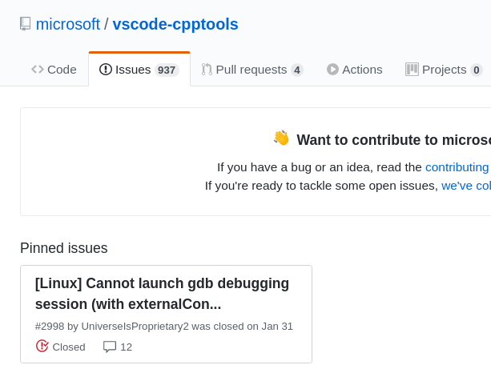

一直以来，我在 Linux 下的 VS Code 的启动调试器都存在无法调试需要获取用户输入的程序，昨天总算是把这个问题解决了。

tldr: 在 Linux 下不要用 lldb，用 gdb，具体原因不清楚，但是我被坑了。

<!-- more -->

## launch.json 和 task.json

VS Code 下启动调试器需要依赖文件夹根目录下的 .vsocde/launch.json 文件，该目录及其子目录的调试器的行为都可以通过在该文件中配置选项来指定。最简单的创建 launch.json 文件的方法是在需要调试的源程序标签页中点击左边 Activity Bar 上的调试器的按钮，当没有 launch.json 文件时，VS Code 会提示根据模板创建 launch.json 文件。然后回到源程序标签下，启动刚刚创建的 launch.json，由于没有生成可调试的可执行文件，需要生成 .vscode/task.json 预先编译源文件生成可调试的可执行文件。正常情况下，接下来应该就可以进行调试。但是在 Manjaro 下使用是我遇到了以下问题。

## externalConsole 选项/默认外部终端的坑

根据 vscode-cpptools 的这个 [issue](https://github.com/microsoft/vscode-cpptools/issues/2998) 中线索，当设置 externalConsole 为 true 时，在 Linux 下，调试器会完全无法启动。设置为 false，则可以启动，但是无法获用户输入（后来证实是我遇到的另一个坑）。

仔细阅读该 issue 可以发现，关键在于 VS Code 的调试器在启动时，如果该选项设置为 true，则 VS Code 会根据 terminal.external.linuxExec 推断在 Linux 下应该启动的默认的 Terminal，并且该选项的默认值为 xterm。但是我的系统上并没有安装 xterm，所以在启动调试器后一直卡顿在这一步。于是安装 xterm。然后调试器正常启动。

## gdb vs lldb

开始时我使用的调试器是 lldb，一切都很正常，唯有在读取用户输入时，无论是内部终端还是外部终端，都无法成功。于是切换到 gdb，成功。从这儿就能感觉到 llvm 在 Linux 下的支持还是不如 gcc，虽然我很喜欢或者说更偏向 clang/llvm。

## 最后

有意思的是，我刚刚引用的那个 issue 是唯一被标记的 issue，可见被坑的人应该不在少数 ;p

