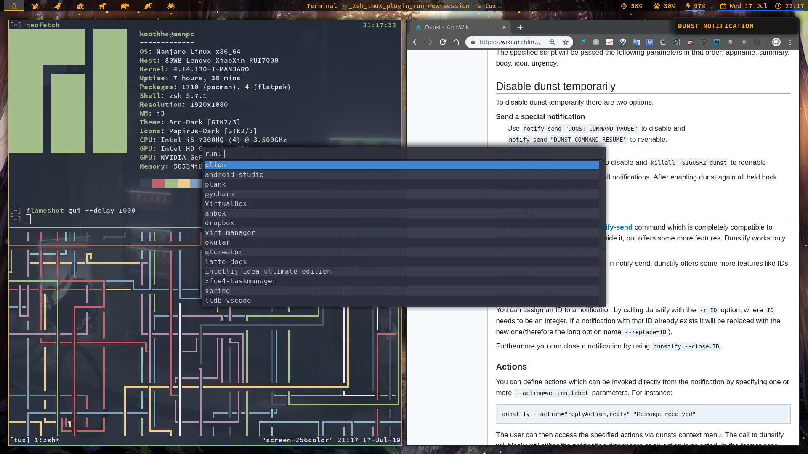

## 写在开头

我恍惚觉得自己这 21 年的生活并没有学到任何东西，也并不知道接下来的这几十年我能有什么变化。

## 这个博客

就是一个死宅随便写点东西的地方

## 关于我

- Arch/Arch-Based Linux 分发版系统日常用户兼轻度 Windows 用户(目前)
- i3wm 重度用户
- Vim 党兼轻度 Emacs 用户，不参与圣战
- Tmux, Zsh 等 *nix 工具日常用户
- JetBrains IDEs 重度用户
- C/C++/Java/Python/Haskell/Scheme 都会一点儿，编程语言名称拼写能手
- 编程苦手，暂时没有拿得出手的项目

## 我的桌面截图

- 桌面环境是 i3-gaps(i3wm)
- 最上面是 Polybar，用于显示基本信息
- 中间是桌面启动器 Rofi，用于启动应用
- 右上角是 Dunst，用于显示系统通知
- 左边的窗口是运行着 Tmux 的 Xfce4-terminal，terminal 的上面是展示系统信息的 neofetch，下面是 [pipes.sh](https://pipeseroni.github.io/)
- 右边的窗口是 Chrome 浏览器