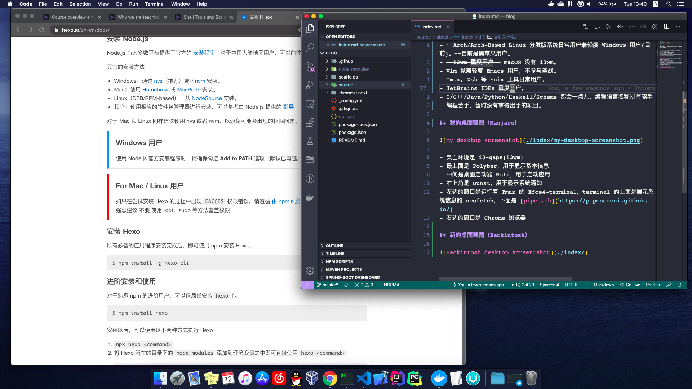

## 写在开头

暂时没有人生目标。

## 关于我

- ~~Arch/Arch-Based Linux 分发版系统日常用户兼轻度 Windows 用户(目前)。~~目前是黑苹果日常用户。桌面系统日常使用 macOS > Linux > Windows。
- ~~i3wm 重度用户~~ macOS 没有 i3wm。
- Vim 党兼轻度 Emacs 用户，不参与圣战。
- Tmux, Zsh 等 *nix 工具日常用户。
- JetBrains IDEs 重度用户。
- C/C++/Java/Python/Haskell/Scheme 都会一点儿，编程语言名称拼写能手
- 编程苦手，暂时没有拿得出手的项目。

## 我的桌面截图（Manjaro）

- 桌面环境是 i3-gaps(i3wm)。
- 最上面是 Polybar，用于显示基本信息。
- 中间是桌面启动器 Rofi，用于启动应用。
- 右上角是 Dunst，用于显示系统通知。
- 左边的窗口是运行着 Tmux 的 Xfce4-terminal，terminal 的上面是展示系统信息的 neofetch，下面是 [pipes.sh](https://pipeseroni.github.io/)。
- 右边的窗口是 Chrome 浏览器。

## 新的桌面截图（Hackintosh）

## 4K 显示器，以及给显示器配个了黑苹果主机

